# 小米商城在线购物系统 

##（源代码+12000字文档+ppt）

## 项目简介
小米商城在线购物系统是一套基于SpringBoot的前后端分离的仿小米的购物系统。 
本系统可以满足电商系统的全流程操作，从商品的上架下架管理以及用户下单、付款、发货、收货、评价等全部功能，还有秒杀等特色功能。 
前端使用Vue框架，后端使用SpringBoot框架，数据库使用的是Mysql。 
本系统功能完善，涉及的技术比较广，难度适中，都是市面上主流的技术，非常适合作为设计项目或开发学习。 
视频介绍：<a href="https://www.bilibili.com/video/BV1s94y1n7h7/?spm_id_from=333.999.0.0" target="_blank">点击查看B站视频介绍</a>

## 功能介绍

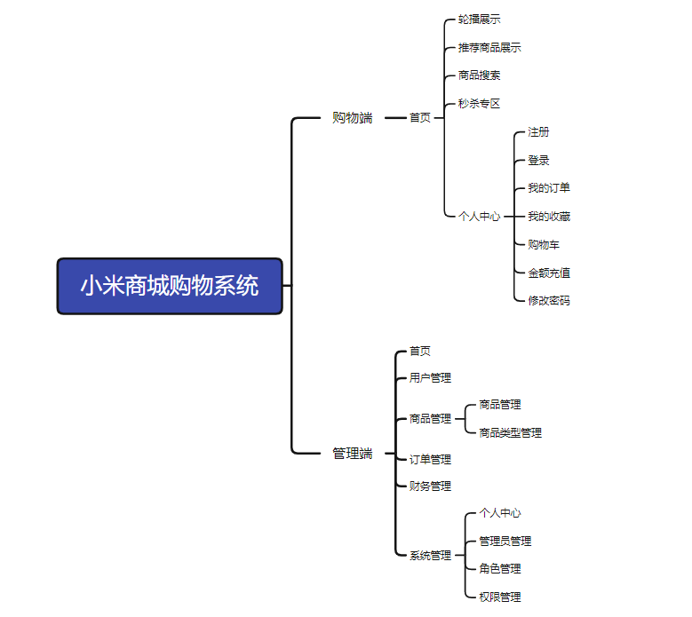

## 技术学习

公众号内还有更多项目供你选择。 

## 技术服务

## 技术栈

| 工具及技术             | 版本    |
| ---------------------- | ------- |
| idea                   |         |
| JDK                    | 1.8     |
| SpringBoot             | 2.2.1   |
| MyBatis                | 1.3.2   |
| JWT                    | 3.4     |
| Vue                    | 2.0     |
| ElementUI              | 2.0     |
| MySQL                  | 5.7     |
| Node                   | v16.16.0|

## 系统图片

#### 1.购物端首页
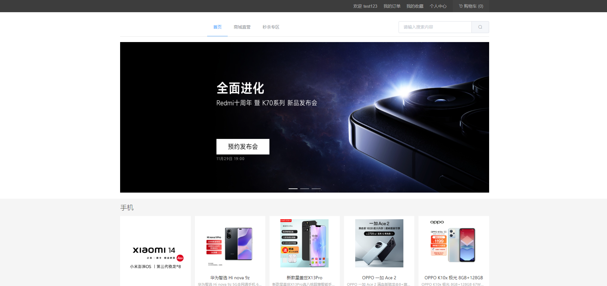 
#### 2.商品展示
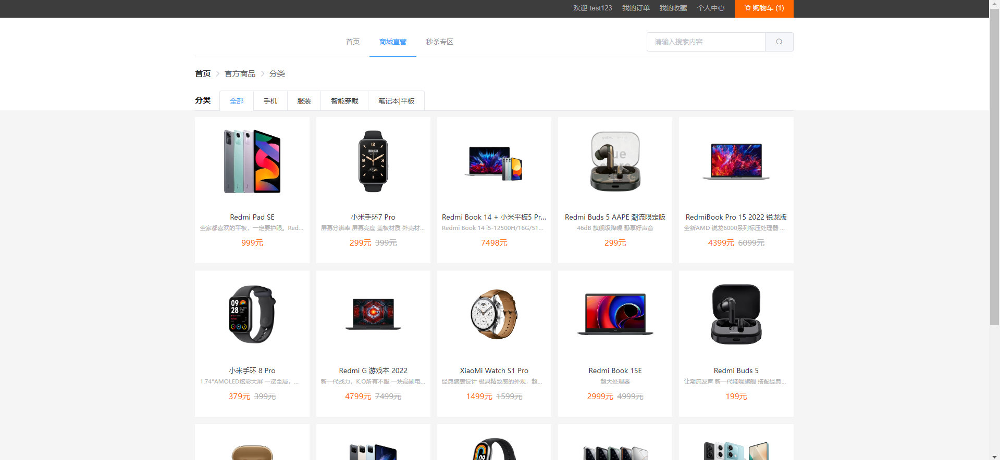 
#### 3.商品详情
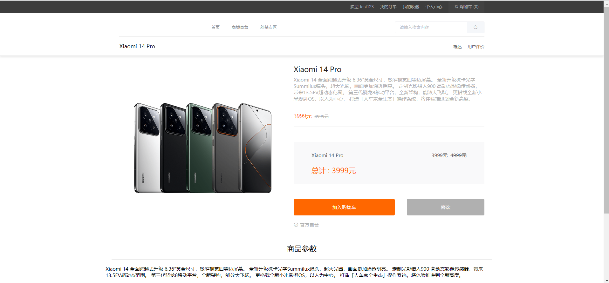 
#### 4.秒杀活动
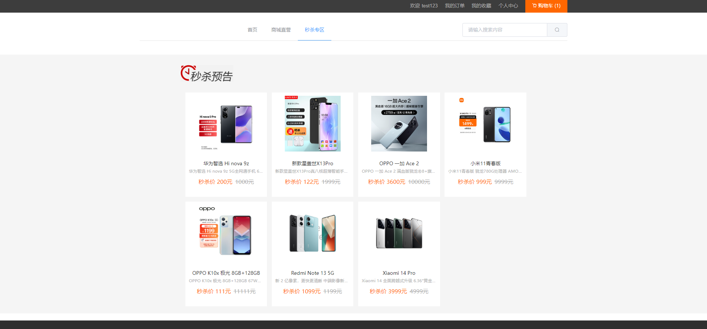 
#### 5.购物车
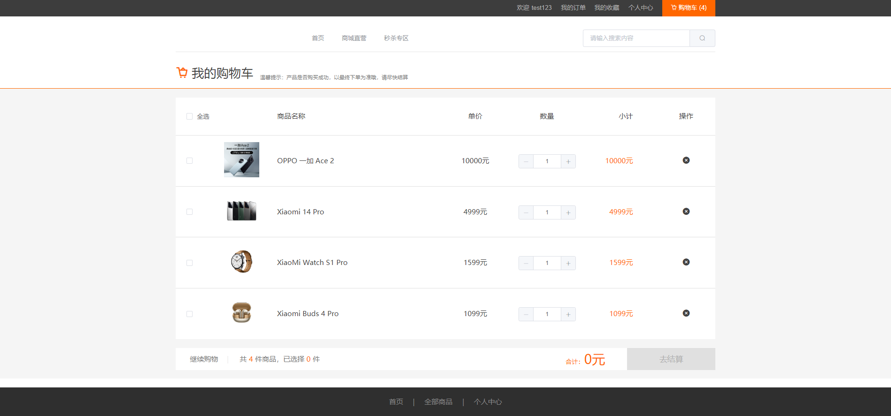 
#### 6.购买商品
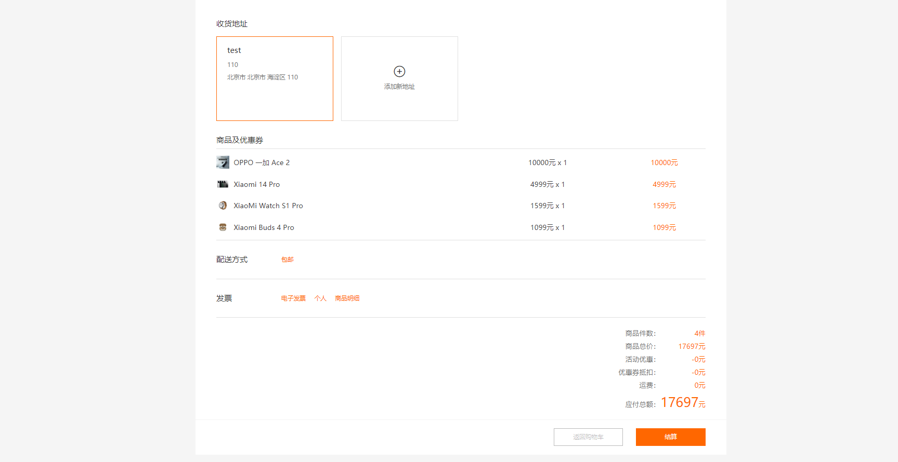 
#### 7.查看我的订单
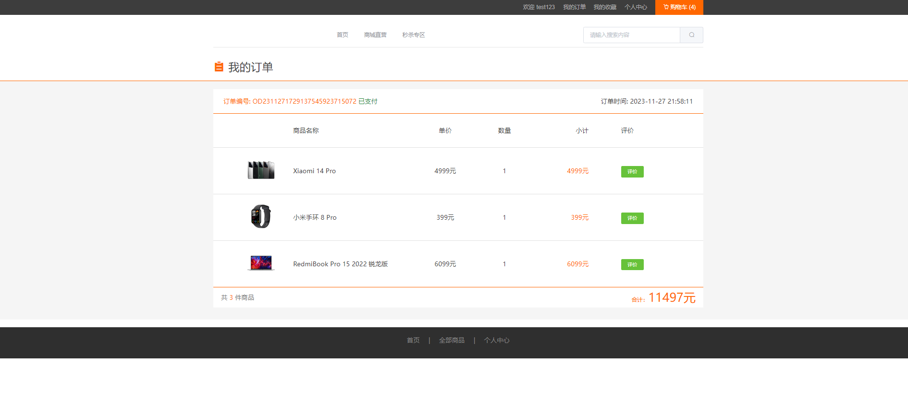 
#### 8.个人中心
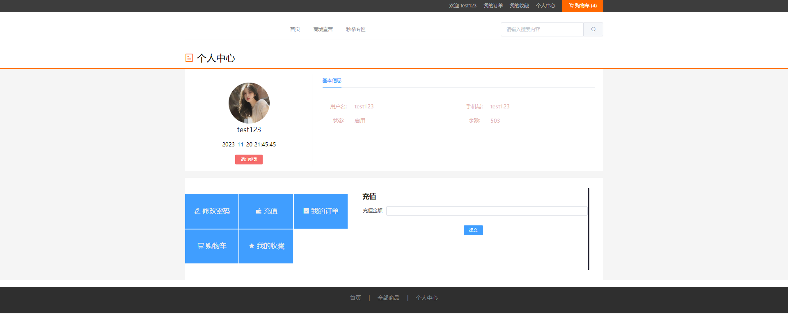 
#### 9.管理端首页
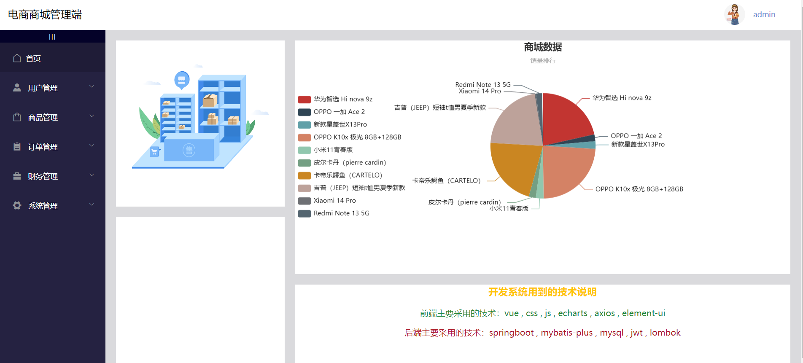 
#### 10.商品管理
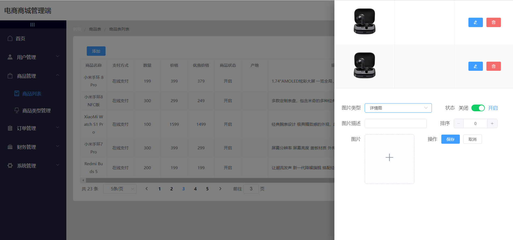 
#### 11.订单管理
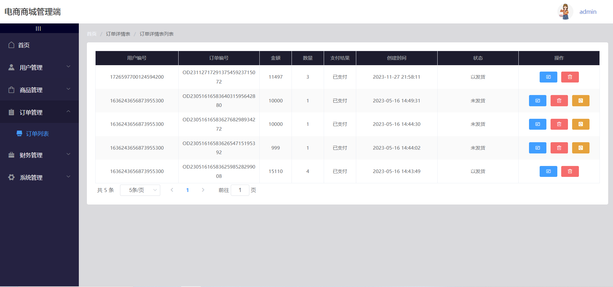 
